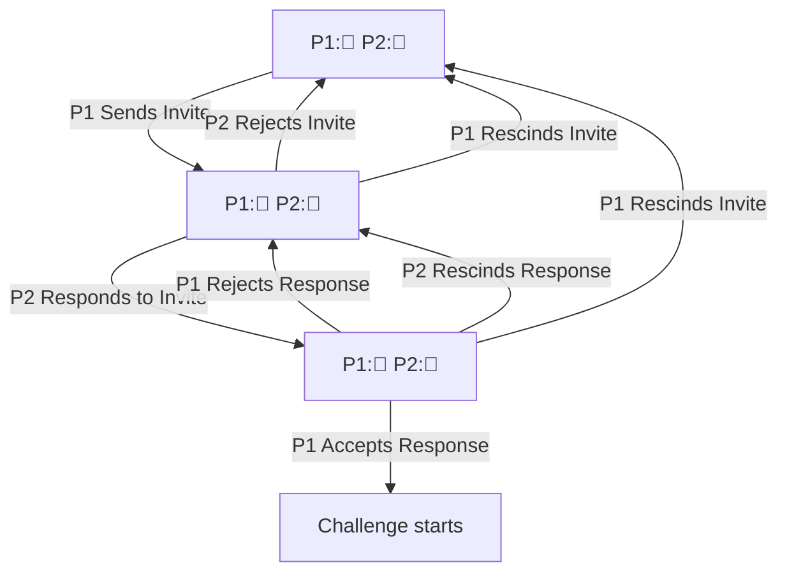

```mermaid
    graph TB
        A[P1:🚫 P2:🚫]--P1 Sends Invite-->B[P1:💂 P2:🚫]
        B--P2 Responds to Invite-->C[P1:💂 P2:💂]
        B--P2 Rejects Invite-->A
        B--P1 Rescinds Invite-->A
        C--P1 Accepts Response-->D[Challenge starts]
        C--P1 Rejects Response-->B
        C--P2 Rescinds Response-->B
        C--P1 Rescinds Invite-->A

        
```